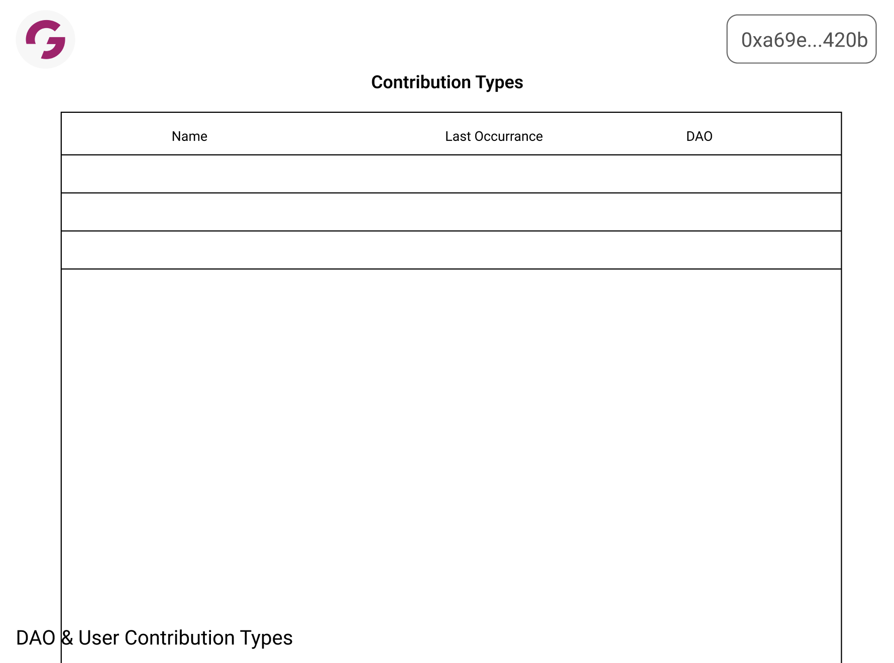

# Contribution Portal

The Contribution Portal provides a historical view of the user's contributions allowing them to attribute them to specific organizations or attest with their own proof.

## Screen(s)

### Overview Screen

- Name
- Date
- Attestations - count of attestations with link to full attestation list
- Verification Level
- DAOs - attributed orgs to the contribution
- Status

### Contribution Types

- Name
- Last Occurance
- DAO attributed, if available

### Attribute to DAO Modal

## User Journeys

Needs:

1. See all contributions user has submitted
2. Edit contributions (as long as edit follows edit rules)
3. Push contributions to certain DAOs

Nices:

1. Request attestations on certain contributions

## Attestation Storage

- Will store an array of attestations on the NFT
- To make it more flexible can have the array point to a structure on ceramic

Would like it to be thought of as verification opposed to attestation

- Make the field flexible enough where it can plug any type of verification into the verify attribute
  - Start with simple straight attestations

Two levels of verification:

1. Attestation - The attestation itself
2. Verification Value (confidence interval/strength of attestation) - Are the attestations legitimate
3. Value of Contribution

The question to ask -> What's the minimum amount of data we need to produce and store for now?

- Level 2 and 3 are abstractions to what we need to build
- What we need is to store the attestations themselves, worry about they strength of attestations later.
- Data to store so far:
  - Attestor Signatrue
  - Attestor Date
  - Confidence Interval

**📌 Note:** As we want it to be more modular, we might want to do it as an extension/upgrade contracts.

- Downsides:
  - Security Vulnerabilities
  - Break third party integrations

[Figma Notes from Meeting](https://www.figma.com/file/9XsgEpVYvP2FiMsLEGtSIe/Transaction-Status-Flow?node-id=0%3A1)

## Still to figure out:

- [ ] What are edit rules? What is the situation of insert vs edit?
- [ ]
