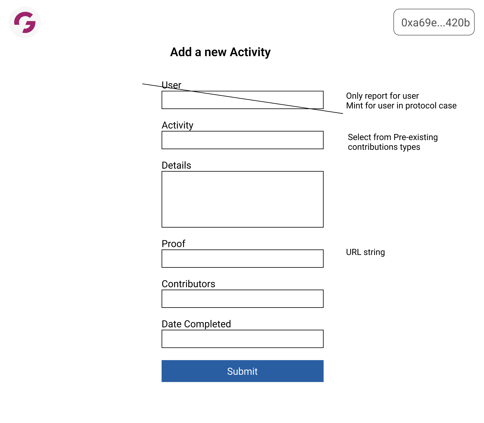
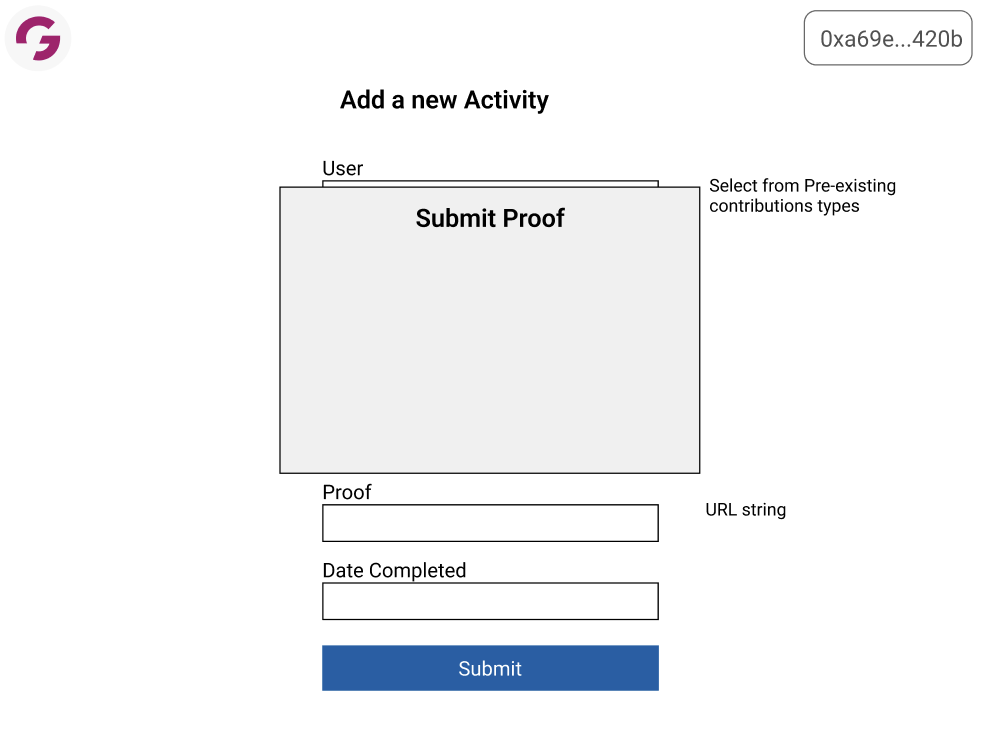

# Reporting Contributions

The reporting form accompanies the [Discord bot](./Bot_Spec.md) as the means to record contributions that can be minted and vouched for.

## Form

### Fields

- Name of Contribution
- Date of Engagement
- Details of the contribution
- Proof of contribution
- Partners in Contribution

### Screens

**Reporting Form**

**Proof Modal**

